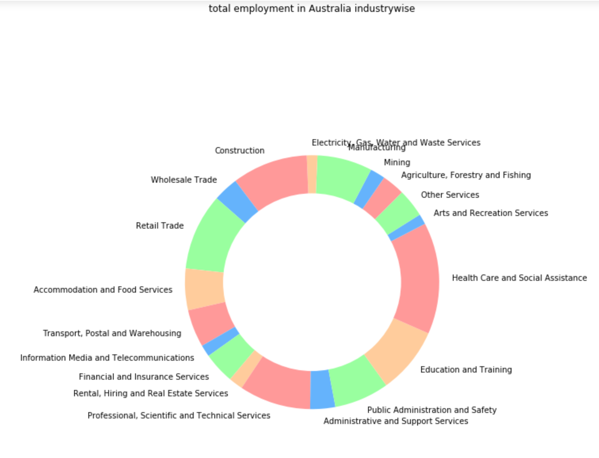
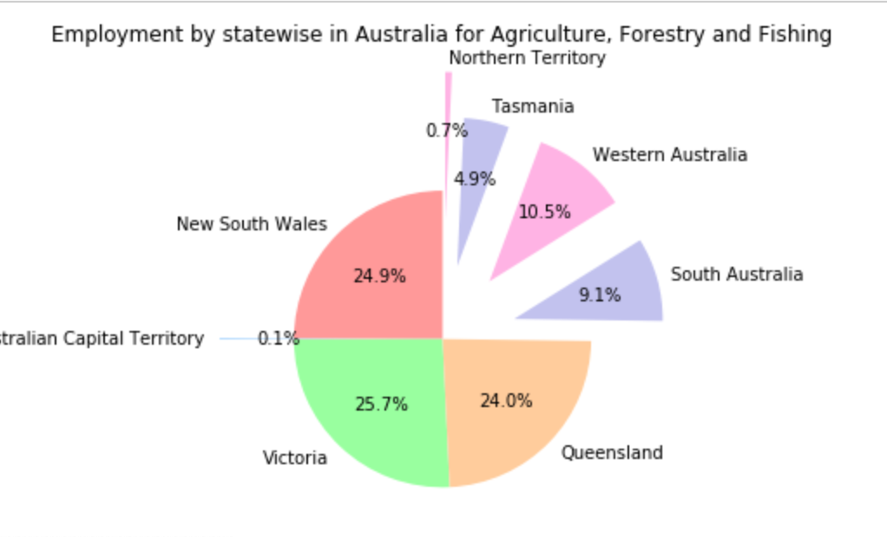
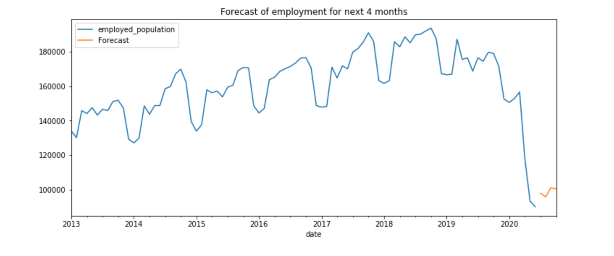
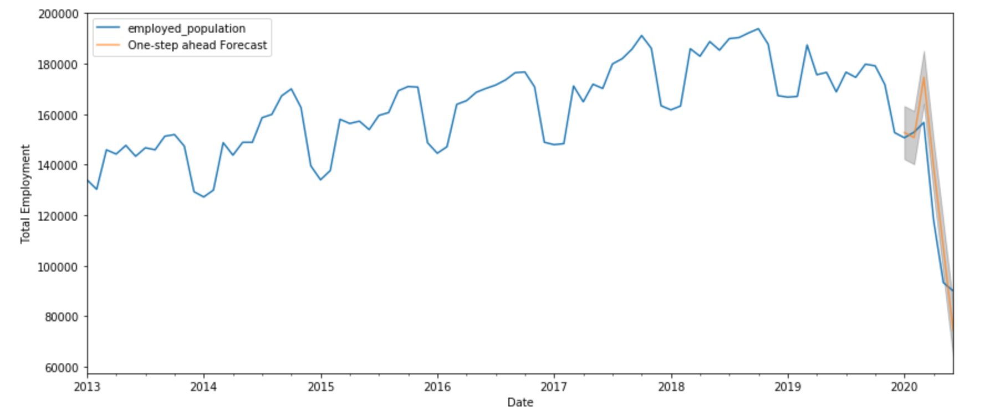

# Covid_analysis on Australian Job market
The jobless rate in Australia has hit the highest level since September 2015, with seasonally adjusted employment falling by 594,300 in April as the economic shock of the coronavirus pandemic cut a swathe through the labour market.Australia lost a further 227,000 jobs between April and May, resulting in a total loss of 835,000 jobs in seasonally adjusted terms since March and a 0.7% jump in unemployment to 7.1%.

This project involves covid effect on Australian Job Market. It consists of two parts as
1. Covid Effect Visualization on Australian employment sector wise, state wise,gender wise👨 etc

2. Second part involves Timeseries Forecast for next 4 weeks in August as data is upto 15 of july.Used Arima Modeling

